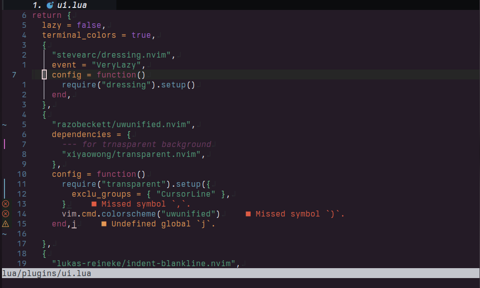

# Uwunified

- Theme inspired by the base16colorscheme named: "uwunicorn"
- Uwunify your Neovim now!

# Usage
- lazy
```lua
{
  "razobeckett/uwunified.com",
  config = function()
    vim.cmd.colorscheme("uwunified")
  end,
}
```

# Example
Presenting to you uwunified neovim:



# Credits
Thanks to [@Calder-Ty](https://github.com/Calder-Ty) -- borrowed most of the code from his [ice-wyvern.nvim](https://github.com/Calder-Ty/ice-wyvern.nvim)
